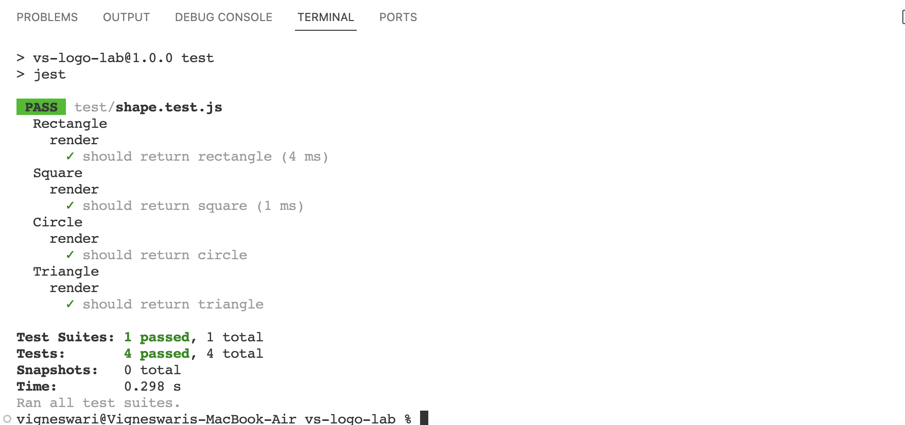

# vs-logo-lab

## Description
This vs-logo-lab is a server-side application that accepts user inputs from the command line and generates logos based on user inputs. The application is developed using server-side technologies like Node.js and runs as a command-line application. The application uses an inquirer package to accept the user inputs and a jest package to test the use cases and create logos in SVG format.

## Installation

To run or execute the application, one must have node installed in the system and other supporting packages like inquirer.js

Follow the guidelines in the given link to install Node.js: https://nodejs.org/en/learn/getting-started/how-to-install-nodejs, 

Follow the guidelines in the given link to install inquirer.js: https://www.npmjs.com/package/inquirer/v/8.2.4

Follow the guidelines in the given link to install jest: https://jestjs.io/docs/getting-started

## Usage

The application source code can be accessed using the link https://github.com/Vigneshwarie/vs-logo-lab

One can download the code from the above link. To use this application, one must install both node.js and inquirer.js, as mentioned in the installation section. Once installed, navigate to the application folder and run the index.js file in the integrated terminal of vscode. Use the command below to the file,

application-folder> node index.js

On successful installation and execution, the application will prompt the user with questions concerning the requirements on the logo to generate a logo.svg file as below.

In order to test the application, one must install jest as dev Dependencies as mentioned in the installation section. Once installed, navigate to the application folder and run the below command,

application-folder> npm test

On success, the result is produced as below.

## Walkthrough Video

[]

## Credits

Usage of the SVG shape and text were referred using the below the links, 

https://developer.mozilla.org/en-US/docs/Web/SVG/Tutorial/Basic_Shapes

https://developer.mozilla.org/en-US/docs/Web/SVG/Tutorial/Texts

## License

Please refer to the LICENSE in the repo.
